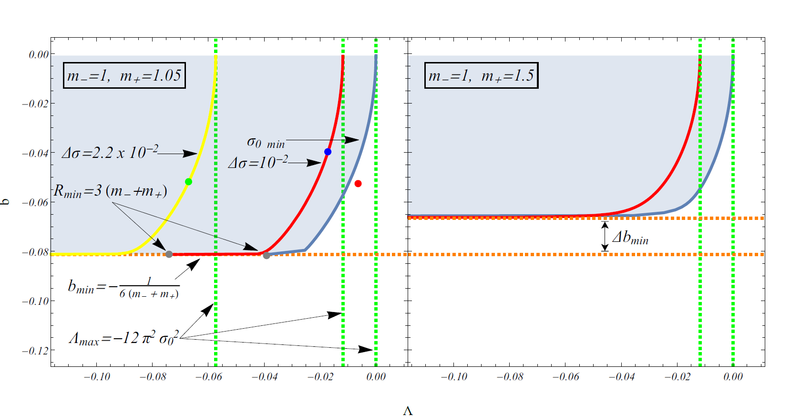

# Existence and Stability of Static Spherical Fluid Shells in a Schwarzschild-Rindler-anti-de Sitter Metric

This is the repository that contains the Mathematica code as well as useful comments that reproduce the figures of [arxiv: ](https://arxiv.org/pdf/.pdf).

## Abstract 
We demonstrate the existence of static stable spherical fluid shells in the Schwarzschild-Rindler-anti-de Sitter (SRAdS) spacetime where dt%5E%7B2%7D%20-%5Cfrac%7Bdr%5E%7B2%7D%7D%7Bf(r)%7D-r%5E%7B2%7D(d%5Ctheta%20%5E2%20%2B%5Csin%20%5E2%20%5Ctheta%20d%5Cphi%20%5E2)) with =1-\frac{2Gm}{r}+2br-\frac{\Lambda}{3}r^2). This is an alternative to the well known gravastar geometry where the stability emerges due to the combination of the repulsive forces of the  interior de Sitter space with the attractive forces of the exterior Schwarzschild spacetime. In the SRAdS spacetime the repulsion that leads to stability of the shell comes from a negative Rindler term while the Schwarzschild and anti-de Sitter terms are attractive. We demonstrate the existence of such stable spherical shells for three shell fluid equations of state: vacuum shell ), stiff matter shell ) and dust shell ) where  is the shell pressure and  is the shell surface density. We also identify the metric parameter conditions that need to be satisfied for shell stability in each case. The vacuum stable shell solution in the SRAdS spacetime is consistent with previous studies by two of the authors that demonstrated the existence sf stable spherical scalar field domain walls in the SRAdS spacetime.

## Citing the paper 
If you use any of the above codes or the figures in a published work please cite the following paper:
 *Existence and Stability of Static Spherical Fluid Shells in a Schwarzschild-Rindler-anti-de Sitter Metric*, George Alestas, George V. Kraniotis and Leandros Perivolaropoulos, [arxiv:2005](https://arxiv.org/pdf/2005.pdf)

Any further questions/comments are welcome.

## Authors List
George Alestas - <g.alestas@uoi.gr>
 George V. Kraniotis - <gkraniot@cc.uoi.gr>
 Leandros Perivolaropoulos - <leandros@uoi.gr>
